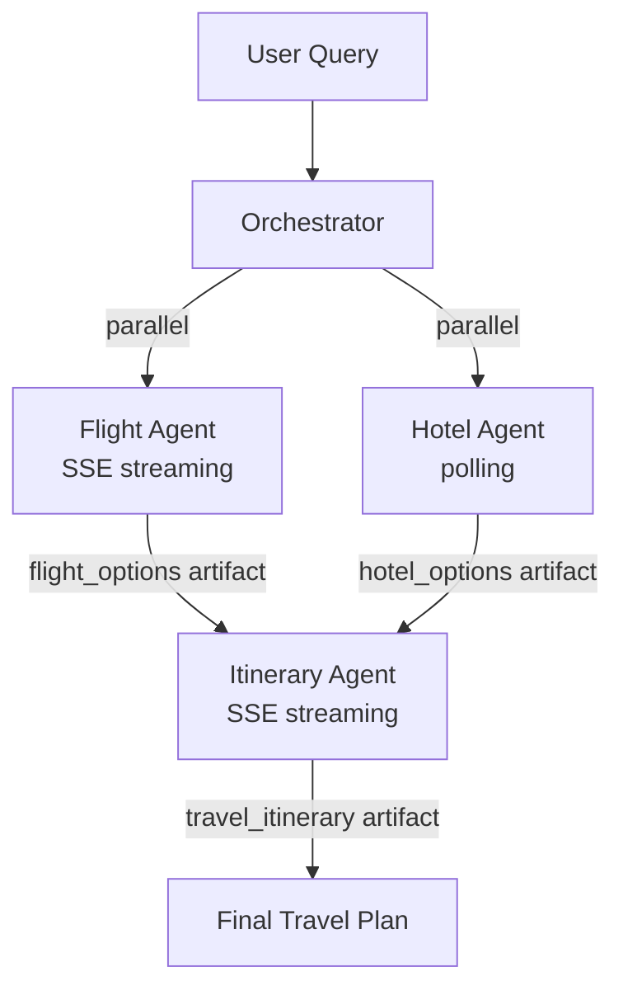

# Multi-Agent Travel Planner - A2A Protocol Tutorial

A complete multi-agent travel planning system built on Google's [Agent2Agent (A2A) protocol](https://google.github.io/A2A/). Three autonomous agents, Flight, Hotel, and Itinerary, discover each other via Agent Cards, stream real-time progress, exchange artifacts, and produce a combined travel plan.

The repo also includes two framework integrations:

- A **LangGraph** workflow where each node delegates to a remote A2A agent.
- A **CrewAI** crew exposed as a drop-in A2A replacement for the native Itinerary Agent.

## Architecture



The orchestrator discovers each agent at its `/.well-known/agent.json` endpoint, routes tasks by skill ID (not name), dispatches the flight and hotel searches in parallel, and forwards both artifacts to the itinerary agent.

## Project structure

```
.
├── agents/
│   ├── flight_agent.py        # Searches flights, streams progress via SSE
│   ├── hotel_agent.py         # Searches hotels, returns one artifact (no SSE)
│   └── itinerary_agent.py     # Combines artifacts into a day-by-day plan
├── agent_cards/
│   ├── flight_card.json       # A2A Agent Card for Flight Agent
│   ├── hotel_card.json        # A2A Agent Card for Hotel Agent
│   └── itinerary_card.json    # A2A Agent Card for Itinerary Agent
├── orchestrator/
│   └── orchestrator.py        # Discovers agents, delegates tasks, merges results
├── integrations/
│   ├── langgraph_travel.py    # A2A agents as LangGraph nodes
│   └── crewai_a2a_bridge.py   # CrewAI crew exposed as an A2A server
├── utils/
│   ├── mock_apis.py           # Mock flight/hotel data for local testing
│   └── auth.py                # JWT auth, rate limiting, webhook validation
├── requirements.txt
├── run_demo.py                # Entry point for the full multi-agent demo
├── .env.example               # Template for environment variables
├── .gitignore
├── LICENSE
└── README.md
```

## Requirements

- Python 3.10 or newer
- pip

## Setup

```bash
# Clone the repository
git clone https://github.com/rajeshai/a2a-travel-planner.git
cd a2a-travel-planner

# Create a virtual environment (recommended)
python -m venv .venv
source .venv/bin/activate        # macOS/Linux
# .venv\Scripts\activate         # Windows PowerShell

# Install dependencies
pip install -r requirements.txt
```

### Environment variables

The three native agents (Flight, Hotel, Itinerary) run on mock data and need no API key. Only the CrewAI bridge needs one.

Copy the template:

```bash
cp .env.example .env
```

Then edit `.env` and add your key:

```
GEMINI_API_KEY=your-actual-gemini-key
```

Get a free Gemini key at <https://aistudio.google.com/apikey>. The free tier has daily request limits, but it is enough for the demo.

> **Note:** `.env` is git-ignored. Never commit it.

## Running the demo

### Option 1: Native A2A agents (no API key needed)

Open four terminals.

```bash
# Terminal 1 — Flight Agent on port 5001
python agents/flight_agent.py

# Terminal 2 — Hotel Agent on port 5002
python agents/hotel_agent.py

# Terminal 3 — Itinerary Agent on port 5003
python agents/itinerary_agent.py

# Terminal 4 — Run the orchestrator
python run_demo.py
```

When prompted, enter a travel query like:

```
Plan a Tokyo trip, March 15-22, 2 travelers, budget under $900
```

Or try a shorter one like `3 days for 2 travellers`.

### Option 2: CrewAI integration (requires Gemini API key)

Replace the native Itinerary Agent with the CrewAI bridge. Stop the native itinerary agent (Ctrl+C in Terminal 3) and run the bridge in its place:

```bash
# Make sure GEMINI_API_KEY is set in .env first

# Terminal 1 — Flight Agent (5001)
python agents/flight_agent.py

# Terminal 2 — Hotel Agent (5002)
python agents/hotel_agent.py

# Terminal 3 — CrewAI Itinerary Bridge (5004, NOT 5003)
python integrations/crewai_a2a_bridge.py

# Terminal 4 — Run with the --crewai flag
python run_demo.py --crewai
```

The orchestrator's workflow is identical. Only the itinerary generation now goes through a CrewAI crew (Researcher + Planner) instead of the native Python agent.

### Option 3: LangGraph integration

Start all three native agents (terminals 1-3 from Option 1), then in a fourth terminal:

```bash
python integrations/langgraph_travel.py
```

This runs the same workflow but with LangGraph managing state and transitions, while A2A handles the inter-agent communication.

## Expected output

Running `python run_demo.py` with the query `3 days for 2 travellers` produces output similar to:

```
Discovered: Flight Search Agent at http://localhost:5001 (skills: ['search_flights'], streaming: True)
Discovered: Hotel Search Agent at http://localhost:5002 (skills: ['search_hotels'], streaming: False)
Discovered: Itinerary Generator Agent at http://localhost:5003 (skills: ['generate_itinerary'], streaming: True)

============================================================
   MULTI-AGENT TRAVEL PLANNER
============================================================

  Enter your travel query below.
  Example: Plan a Tokyo trip, March 15-22, 2 travelers, budget under $900

  Your query: 3 days for 2 travellers

============================================================
Travel Planner — 3 days for 2 travellers
============================================================

Dispatching parallel searches...
  -> Flight Search Agent: searching flights
  -> Hotel Search Agent: searching hotels

  [Flight Search Agent] (TaskState.working) Searching flights to Tokyo...
  [Hotel Search Agent] (TaskState.working) polling...
  [Hotel Search Agent] (TaskState.completed) polling...
  [Flight Search Agent] (TaskState.working) Found 5 flights. Filtering by preferences...
  [Flight Search Agent] (TaskState.working) Top option: ANA NH107 — $689 nonstop
  [Flight Search Agent] (TaskState.completed) Flight search complete. 5 options within budget.

Flight search: 1 artifact(s)
Hotel search: 1 artifact(s)

  -> Itinerary Generator Agent: generating itinerary...

  [Itinerary Generator Agent] (TaskState.working) Building day-by-day itinerary...
  [Itinerary Generator Agent] (TaskState.working) Adding restaurant and activity suggestions...
  [Itinerary Generator Agent] (TaskState.completed) Itinerary ready — 3 days, 13 activities.

========================================================================
  TRAVEL PLAN — 3 days for 2 travellers
========================================================================

  FLIGHTS
  --------------------------------------------------------------------
  Airline      Flight   Route                          Price Duration
  ------------ -------- ---------------------------- ------- ----------
  ANA          NH107    SFO 6:00 PM > NRT 10:00 P       $689 11h 00m
  United       UA837    SFO 11:00 AM > NRT 3:20 PM      $756 11h 20m
  ANA          NH101    SFO 10:30 AM > NRT 2:30 PM      $847 11h 00m

  HOTELS
  --------------------------------------------------------------------
  Hotel                        Location                Price  Rating
  ---------------------------- ------------------ ---------- -------
  Hoshinoya Tokyo              Otemachi, Tokyo        $450/n     4.8
  The Prince Park Tower Tokyo  Minato, Tokyo          $210/n     4.6
  MUJI Hotel Ginza             Ginza, Tokyo           $178/n     4.4

  ITINERARY
  --------------------------------------------------------------------

  Day 1: Arrival & Shinjuku Exploration
    - Arrive at Narita/Haneda Airport
    - Check into hotel
    - Explore Shinjuku Gyoen National Garden
    - Dinner at Omoide Yokocho (Memory Lane)

  Day 2: Temples & Traditional Culture
    - Morning visit to Senso-ji Temple in Asakusa
    - Explore Nakamise Shopping Street
    - Lunch: authentic ramen in Asakusa
    - Afternoon at Meiji Shrine
    - Evening in Harajuku — Takeshita Street

  Day 3: Modern Tokyo & Tech
    - TeamLab Borderless digital art museum
    - Lunch in Odaiba waterfront
    - Akihabara Electric Town exploration
    - Dinner at an izakaya in Yurakucho

  TIPS
  --------------------------------------------------------------------
    * Get a Suica/Pasmo card for easy transit
    * Download Google Translate with Japanese offline pack
    * Carry cash — many small restaurants don't accept cards
    * Buy a 7-day Japan Rail Pass if planning day trips

========================================================================

  (Raw JSON also saved to travel_plan_output.json)
```

The exact counts depend on your query (number of days, budget filter). With no budget filter, all 5 mock flights match, and the top 3 by price are shown. The itinerary covers up to 7 days because `utils/mock_apis.py` only defines 7 days of activities. Requests for longer trips are capped.

## How it works

Each agent exposes three things on its HTTP server:

1. An **Agent Card** at `/.well-known/agent.json` describing its skills, capabilities, and authentication requirements.
2. A **JSON-RPC endpoint** at `/` for task submission (`message/send`, `message/stream`, `tasks/get`, `tasks/cancel`).
3. An **event stream** (SSE) for streaming agents, used by the orchestrator to receive progress updates and artifacts in real time.

The orchestrator (`orchestrator/orchestrator.py`) does four things:

- **Discovers** agents by fetching their Agent Cards.
- **Routes** by skill ID - `search_flights`, `search_hotels`, `generate_itinerary` - so an agent can be swapped without touching orchestrator code.
- **Dispatches in parallel** via `asyncio.gather`.
- **Chains artifacts** - flight and hotel artifacts become the data input for the itinerary agent.

## Troubleshooting

**`ModuleNotFoundError: No module named 'a2a.server.apps'`**
The A2A SDK was installed without the HTTP server extras. Reinstall with:

```bash
pip install 'a2a-sdk[http-server]>=0.3.0,<0.4.0'
```

**`Failed to discover agent at http://localhost:5001: …`**
The agent isn't running, or it's listening on a different port. Check that the agent's terminal shows `running at http://0.0.0.0:5001` and that nothing else is bound to that port (`lsof -i :5001` on macOS/Linux).

**`No agent found with skill 'crew_itinerary'`**
You ran `run_demo.py --crewai` but the CrewAI bridge isn't running. Start `integrations/crewai_a2a_bridge.py` (port 5004) first.

**`401 Unauthorized` or authentication errors from Gemini**
The `GEMINI_API_KEY` in `.env` is missing, expired, or rate-limited. Generate a fresh key at <https://aistudio.google.com/apikey>.

**Streaming client hangs forever**
A `final=True` status event was never emitted by the agent. Check each code path through the executor's `execute()` to confirm it always ends with a terminal event.

**`requests.exceptions.ProxyError` or SSE messages don't arrive**
A buffering proxy or load balancer is breaking the SSE connection. For local development, bypass any HTTP proxy. For production, set `proxy_buffering off` on nginx, or flip the agent's card to `"streaming": false` and let polling handle it.

## Extending this project

Some directions worth exploring:

- **Real APIs:** Replace `utils/mock_apis.py` with Amadeus for flights and Booking.com or Hotels.com partner APIs for hotels.
- **More agents:** Add a budget advisor, visa-requirement checker, or weather agent. Each new agent slots in via its Agent Card — the orchestrator routes by skill, so existing code doesn't change.
- **Persistent task store:** Swap `InMemoryTaskStore` for a Redis or database-backed implementation so agents can be restarted without losing in-flight tasks, and so multiple replicas can share state.
- **Production auth:** `utils/auth.py` shows the JWT + JWKS pattern. For cross-org deployment, layer in mTLS, per-caller rate limiting, and audit logging.

## License

[MIT](LICENSE)
